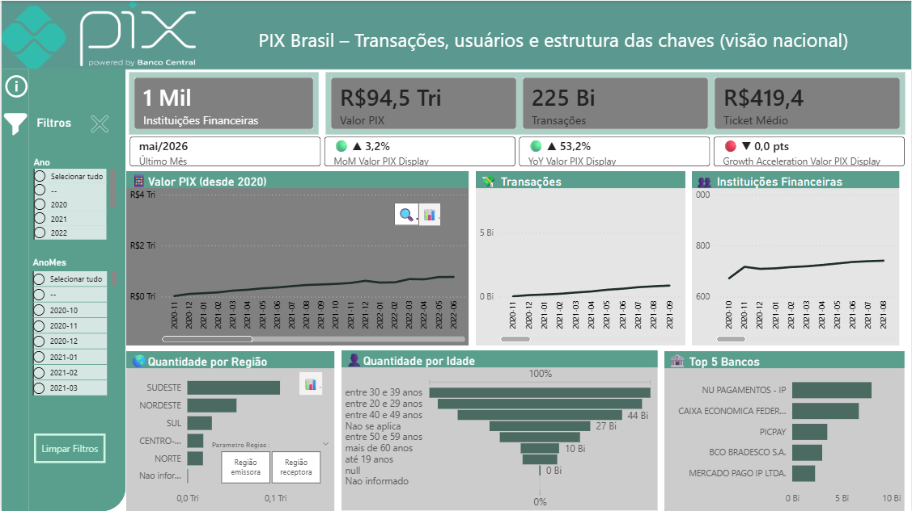
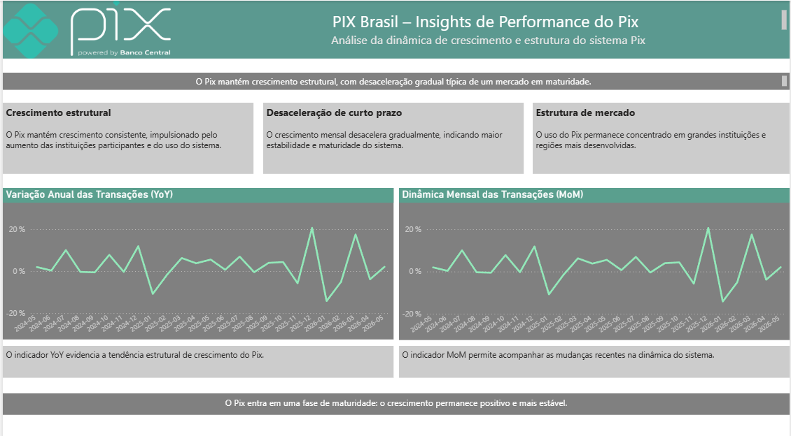
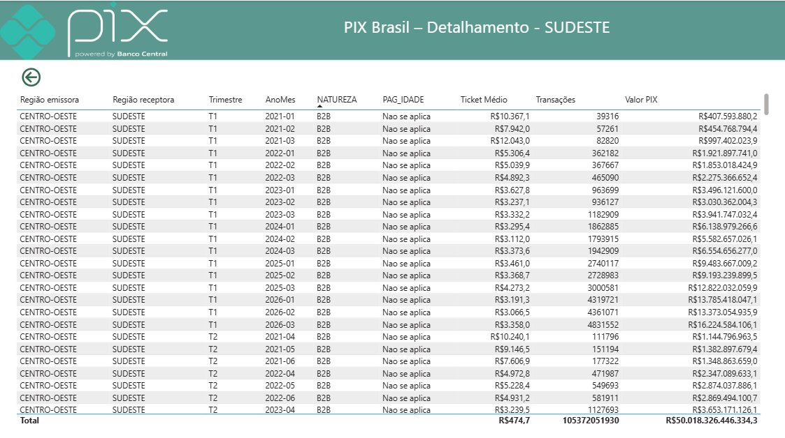

# pix-brasil-powerbi-dashboard
Interactive Power BI dashboard featuring ETL, Star Schema modeling, DAX, Time Intelligence (YoY/MoM), drill-through, responsive design, and data storytelling using official PIX data from the Central Bank of Brazil.

## Análise da Evolução do Sistema de Pagamentos PIX no Brasil

---

**Descrição**

Este projeto consiste no desenvolvimento de um dashboard interativo no Power BI para analisar a evolução do sistema de pagamentos instantâneos PIX no Brasil.

O projeto contempla todas as etapas de um fluxo de Business Intelligence, desde a preparação dos dados até a criação de indicadores, visualizações interativas e geração de insights de negócio.

---

**Objetivo**

O objetivo deste projeto é analisar a evolução do PIX desde sua implementação, respondendo à seguinte questão de negócio:

O sistema PIX continua em forte crescimento ou já apresenta sinais de maturidade?

Para isso, o dashboard permite acompanhar:

Evolução do número de transações;
Evolução do volume financeiro movimentado;
Crescimento do número de instituições participantes;
Tendências ao longo do tempo por meio de indicadores dinâmicos.

---

**Fonte de Dados**

Os dados utilizados neste projeto são públicos e disponibilizados pelo Banco Central do Brasil (BACEN).

Dataset oficial: [Estatísticas do Pix – Portal de Dados Abertos do Banco Central do Brasil](https://dadosabertos.bcb.gov.br/pt_BR/dataset/pix?utm_source=chatgpt.com)

---

**Tecnologias utilizadas**

 - Power BI Desktop
 - Power Query
 - DAX
 - Modelagem de Dados (Star Schema)
 - Time Intelligence (YoY e MoM)
 - Visualização de Dados
 - Storytelling com Dados

---

**Arquitetura do Projeto**

O fluxo de dados segue as seguintes etapas:

Banco Central do Brasil  
↓  
Power Query (ETL)  
↓  
Star Schema  
↓  
DAX  
↓  
Dashboard Power BI

---

**Modelagem de Dados**

O modelo dimensional foi construído a partir de diferentes conjuntos de dados oficiais do Banco Central do Brasil, organizados em tabelas fato e dimensões conforme as melhores práticas de Business Intelligence.

O modelo foi desenvolvido seguindo a arquitetura **Star Schema**, separando tabelas fato e dimensões para otimizar o desempenho, facilitar a criação de medidas em DAX e garantir uma análise eficiente dos dados.

---

**Preparação dos Dados**

O projeto incluiu as seguintes etapas:

 - Importação dos dados oficiais;
 - Limpeza e transformação dos dados (ETL);
 - Padronização dos campos de data;
 - Criação da dimensão Calendário;
 - Modelagem em esquema estrela (Star Schema);
 - Criação dos relacionamentos entre tabelas;
 - Desenvolvimento de medidas utilizando DAX.

---

**Indicadores Desenvolvidos**

O dashboard apresenta indicadores dinâmicos para acompanhar:

 - Valor total movimentado pelo PIX;
 - Número de transações;
 - Número de instituições participantes;
 - Crescimento anual (Year-over-Year – YoY);
 - Crescimento mensal (Month-over-Month – MoM).

---

**Funcionalidades do Dashboard**

 - Cartões de KPI interativos;
 - Filtros dinâmicos;
 - Navegação entre páginas;
 - Drill-through;
 - Tooltips personalizados;
 - Títulos dinâmicos;
 - Layout responsivo;
 - Botão para redefinição dos filtros.

---

**Principais Insights**

A análise dos dados permite observar que:

O PIX mantém uma trajetória consistente de crescimento desde sua implementação;
As taxas de crescimento sugerem uma transição gradual para uma fase de maior maturidade do mercado;
Grande parte do volume financeiro concentra-se nas principais instituições financeiras e regiões do país.

---

##  Dashboard

**Visão Geral**

**Visão Analítica**

**Visão de Detalhes**

---

**Arquivo Power BI**

O arquivo DashboardPIX.pbix está disponível neste repositório para consulta e análise. Ele permite explorar toda a construção do projeto, incluindo o processo de modelagem dos dados, as medidas desenvolvidas em DAX e o dashboard interativo criado no Power BI.

---

**Licença**

Este projeto está sob a licença MIT. Consulte o arquivo LICENSE para mais informações.

